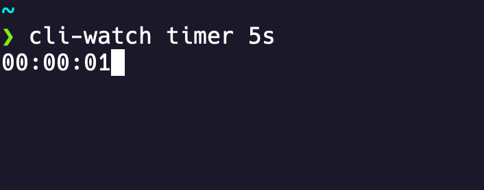

# Command-line watch tool
A simple, lightweight command-line watch tool.


## Features
- Timer: Count down from a specified duration (in Go time format).
- Stopwatch: Count up from zero.

## Install
```bash
go install https://github.com/ondrejmalina/cli-watch@latest
```

## Usage
For timer, specify duration in Go format. For stopwatch, no time is needed.
```bash
cli-watch timer 2m40s
cli-watch stopwatch
```

## Key bindings
- `p`: Pause
- `r`: Resume
- `Esc / Ctrl+C`: Stop and exit.
